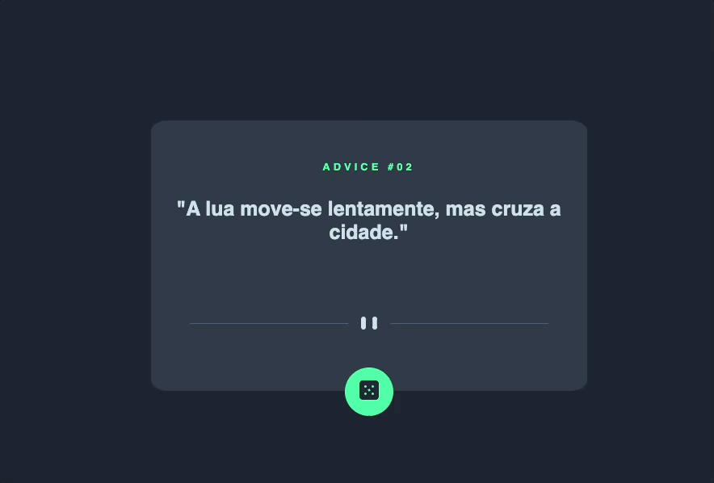

# Advice generator app v1
Exercício de HTML+ CSS avançado do curso Dev Quest, baseado no desafio o Frontend Mentor “Advice generator app coding challenge”, sem a parte de JS nesse primeiro momento. 
Com o proposito de construir um aplicativo que gere conselhos aleatórios. 📝

## Tecnologias utlizadas
- HTML
- CSS

## Dificuldades no projeto
- Posicionar e alinhar imagens
- Estilizar as classes no css
- Criar bons nomes para as classes
- Utilizar o flexbox de maneira eficiente

