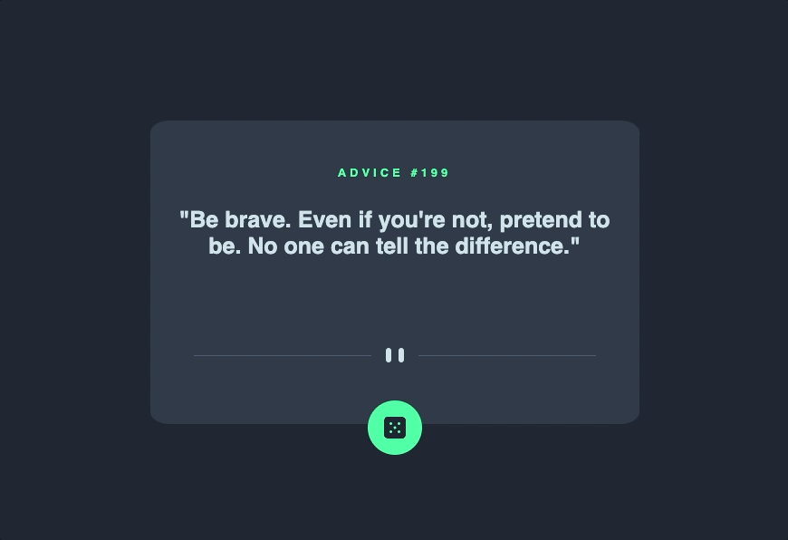

# Advice generator app
Exercício de HTML+ CSS + Javascript do curso Dev Quest, baseado no desafio o Frontend Mentor “Advice generator app coding challenge”.
Com o proposito de construir um aplicativo que gere conselhos aleatórios utilizando uma API. 📝

## Tecnologias utlizadas
- HTML
- CSS
- Javascript

## O que aprendi no projeto
- Trabalhar com API utilizando o fetch
- Melhorei meus conhecimentos de Javascript; funções, variáveis, constantes e etc
- Melhor compressão e domínio do DOM 

